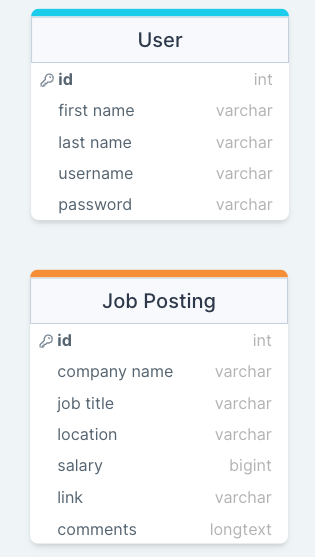

# Backend Project: Job Tracker Application 
---
- **Creators:** Lance Bowers, Sabrina Chen, Christian Mpabuka, Jonathan Marrero, Athena HooSang
- **Description:** A simple job application website that allows users to sign in and see a collection of the jobs they've applied to in one place. Every job posting will contain pertinent information regarding the company, position, salary, and other related details on their display page. Users will be able to sign up/log in, create a new job app, edit an existing app, view all postings, display an individual job posting, and peruse all user job postings. Bonus functionality would include the ability to archive unavailable job postings.
- **Technologies Used:** Express | Mongoose | Cors | Morgan | Node | Render | JavaScript | Trello
## Models
---

## The Route Table
---
| Endpoint | Method | Description |
|----------|--------|-------------|
| /jobs | GET | returns all job postings |
| /jobs/:id | GET | returns a single job posting by id |
| /jobs | POST | creates a new job post |
| /jobs/:id | PUT | updates a job posting based on id |
| /jobs/:id | DELETE | deletes a job posting by id |
| /signup | GET | returns user signup page
| /signup | POST | creates a new user |
| /login | GET | returns login page |
| /login | POST | allows user to login with their sign-in info|
### Trello
---
[View Trello Board](https://trello.com/b/h9laJ0ri/application-tracker)